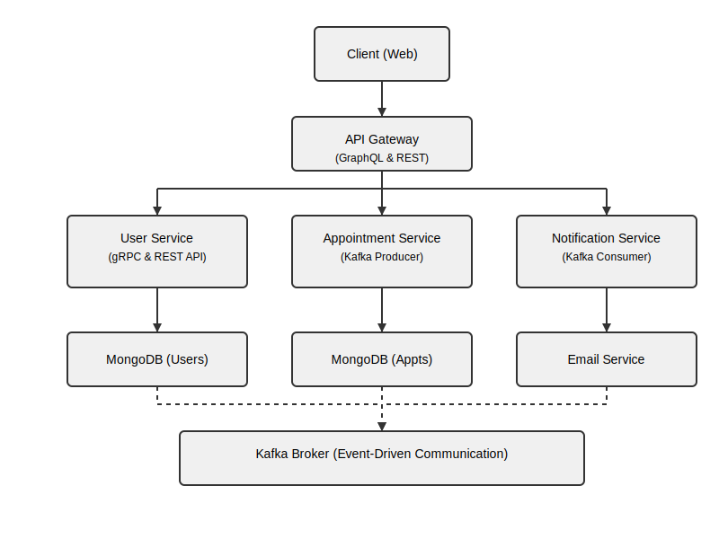

## Architecture

Voici une représentation visuelle de l'architecture du projet :

# Medic Booking Platform

A microservices-based platform for managing medical appointments, users, and notifications.

## Features

- **User Management**: Register, login, and manage users (patients and doctors).
- **Appointment Management**: Create, update, and cancel appointments.
- **Notifications**: Send email notifications for appointment confirmations.
- **GraphQL API**: Unified API Gateway with GraphQL and REST endpoints.
- **Event-Driven Architecture**: Kafka for inter-service communication.

## Architecture

The platform consists of the following services:

1. **API Gateway**:
   - Acts as the entry point for clients.
   - Provides GraphQL and REST APIs.
   - Communicates with other services via HTTP and gRPC.

2. **User Service**:
   - Manages user data (patients and doctors).
   - Provides gRPC and REST APIs.

3. **Appointment Service**:
   - Manages appointments.
   - Publishes events to Kafka for notifications.

4. **Notification Service**:
   - Listens to Kafka events.
   - Sends email notifications using Nodemailer.

## Technologies

- **Backend**: Node.js, Express.js
- **Database**: MongoDB
- **Messaging**: Kafka
- **GraphQL**: Apollo Server
- **gRPC**: For inter-service communication
- **Docker**: Containerization
- **Nodemailer**: Email notifications

## Setup

### Prerequisites

- Docker and Docker Compose installed.

### Steps

1. Clone the repository:
   ```bash
   git clone https://github.com/your-repo/medic-booking-platform.git
   cd medic-booking-platform